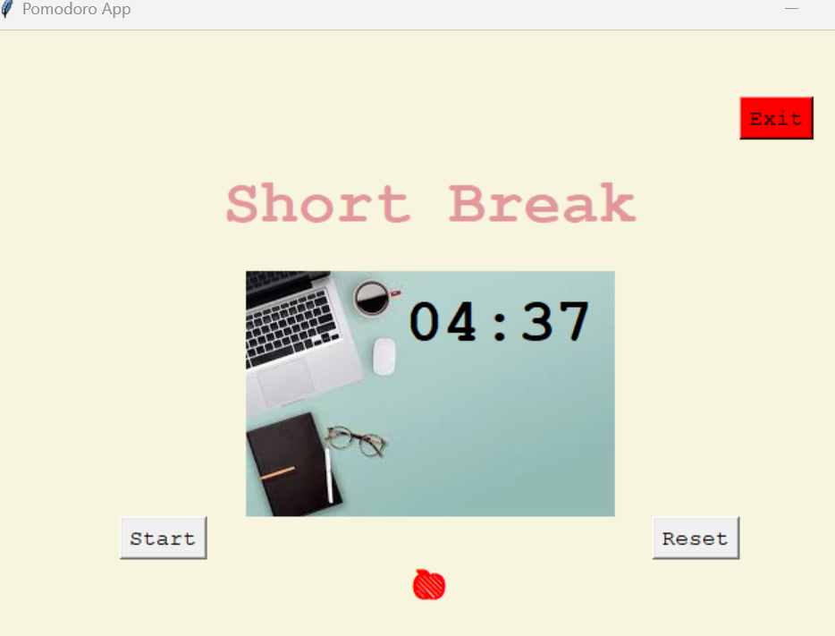

# Pomodoro Timer App



A simple Pomodoro timer application built using Python and Tkinter.
## Table of Contents

- [Description](#description)
- [Features](#features)
- [Installation](#installation)
- [Usage](#usage)
- [Author](#author)

## Description
The Pomodoro Timer App is a basic implementation of the Pomodoro technique, a time management method that helps improve productivity by breaking work into focused intervals (typically 25 minutes), followed by short breaks. This application uses the Tkinter library for the graphical user interface.
## Features

- Countdown timer for work sessions, short breaks, and long breaks.
- Apple display to indicate completed work sessions.
- Start, reset, and exit buttons for easy control.

## Installation
1. Clone the repository:
   ```bash
   git clone https://github.com/laurianerzb/pomodoro-timer-app.git
2. Navigate to the project directory:
   ```bash 
   cd pomodoro-timer-app
3. Make sure you have Python installed. This application was built using Python 3.9

## Usage

1. Run the application by executing the Python script:
   ```bash 
   python pomodoro_timer.py
2. The main application window will appear, displaying the timer and control buttons.
3. Click the "Start" button to begin a timer session. The timer will automatically switch between work sessions, short breaks, and long breaks.
4. Click the "Reset" button to reset the timer and start a new Pomodoro session.
5. Click the "Exit" button to close the application.
6. The apple emojis will indicate completed work sessions with 🍎 symbols.

## Author
- [laurianerzb](https://github.com/laurianerzb)
